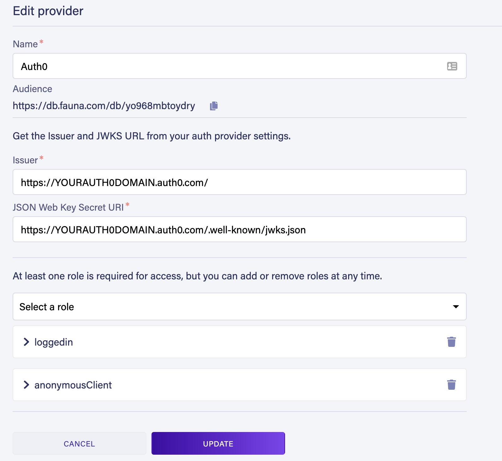

This repository contains unofficial patterns, sample code, or tools to help developers build more effectively with [Fauna][fauna]. All [Fauna Labs][fauna-labs] repositories are provided “as-is” and without support. By using this repository or its contents, you agree that this repository may never be officially supported and moved to the [Fauna organization][fauna-organization].

---

# faunaflix
faunaflix is *Fauna in a nutshell*, delivered in the form a demo app that mimicks a video streaming service for kids. 
We picked a streaming service to showcase Fauna because we use these services everyday but probably don't realize
the database implementations that go into building such a product. With faunaflix, we've found is great way to
highlight some key Fauna properties and functionality, such as:
* Flexible data modeling – including relations/joins
* ACID transactions
* Use Fauna as an authentication provider – or integrate with any 3rd party OpenID Connect Identity Provider
* Delivered via API, without a backend and with zero Ops!

We'd like to point out that despite the relative complexity of such an app, it is easily modeled in Fauna:
> Note that Fauna only handles the metadata of the app. The actual video streaming itself is stubbed 
by referencing YouTube url's


:bulb: Fauna is a document database that supports joins!

## Project setup

### Step 0. Clone the repo
```
git clone https://github.com/fauna-labs/faunaflix.git
cd faunaflix
```

### Step 1. Install dependencies
```
npm install
```

### Step 2. Create a database and obtain the "Admin Key" for the setup scripts (in the next step) to access the database.
1. Signin to Fauna. [Register](https://dashboard.fauna.com/accounts/register) for a free for life developer account
   if you haven't done so already.
2. Create a database: 

  

   * Name your database `faunaflix`
   * Choose the "Classic" Region Group

3. Click [Security] in the left sidebar, then click the [New key] button.

  

   * In the "New key" form, the current database should already be selected. 
   * For the "Role" field, leave it as "Admin". Optionally, add a key name. 
   * Next, click [Save] and copy the key’s secret displayed on the next page. **It is never displayed again.**

### Step 3. Run "migrations"

1. Set the `FAUNA_ADMIN_KEY` environment variable to the key you just generated above:
  ```
  export FAUNA_ADMIN_KEY=<<admin key>>
  ```

2. Look in the [fauna-schema-migrate/resources](/fauna-schema-migrate/resources) folder and peruse the contents. 
   These are all the Collections, Indexes, Functions and Roles that we'll be creating using the
   [fauna-schema-migrate](https://github.com/fauna-labs/fauna-schema-migrate) tool
   (which should already be installed when you ran `npm install` earlier).
   In the [fauna-schema-migrate/migrations](/fauna-schema-migrate/migrations) folder,
   migrations are already pre-generated (from the files in `resources`).
   So simply run the script command below to apply them:

  ```
  npm run fauna-schema-migrate
  ```

3. After the step above completes, take a browse in your Fauna console and notice that Collections, Indexes, Functions, 
   Roles and an AccessProvider has been created. However, some Collections need to be populated with operational data. 
   So run this setup script:

  ```
  npm run setup
  ```

### Step 4. Compile and run the Single-Page Application (SPA)

1. The Admin Key previously generated should only be used to setup Fauna resources. At this point you don't need it anymore.
   However, the SPA needs a different Fauna key in order to work. This key is one that's scoped to only allow access to
   limited Fauna resources (such as the [`Login`](/fauna-schema-migrate/resources/functions/Login.fql)
   and [`GetPreviews`](/fauna-schema-migrate/resources/functions/GetPreviews.fql) functions). 
   
   Click [Security] in the left sidebar, then click the [New key] button.
   
  

   * In the "New key" form, the current database should already be selected. 
   * For the "Role" field, select "anonymousClient". **This was one of the Roles created during the migration step.**
   * Next, click [Save] and copy the key’s secret displayed on the next page. **It is never displayed again.**

2. Create a file `.env.development.local` and populate with these values:
  ```
  VUE_APP_FAUNA_KEY_ANONYMOUS=<<key that was generated in the previouis step>>
  ```

3. Compile and run the SPA:
  ```
  npm run serve
  ```

Your local webserver is now running the app. Visit http://localhost:8080/ to
check it out.

### Step 5. Log in
There's a **LOGIN** link in the upper right corner of the screen.
A test user was created when you ran the `setup` script:
* username: `flixuser@mailinator.com`
* password: `fauna123#`

You can also create additional users by executing the following command in the
**Shell** section of the [Fauna Dashboard](https://dashboard.fauna.com):
```
Create(
  Collection("Users"),
  {
    data: { email: "xyz@testest.com" },
    credentials: {
      password: "abc123"
    }
  }
)
```
> See [Credentials](https://docs.fauna.com/fauna/current/security/credentials) for more info.

---

## External Authentication
faunaflix also includes a integration with [Auth0](https://auth0.com/). This uses Fauna's built-in [External authentication](https://docs.fauna.com/fauna/current/security/external/). See [Auth0 configuration](https://docs.fauna.com/fauna/current/security/external/auth0) for more info.

### Setup External Authentication with Auth0
1. In your Fauna dashboard, click [Security] in the left sidebar, then click the [Providers] button. 
   You should notice an `Auth0` "AccessProvider" already created by the migration script. Click the "gear" icon to edit it.
  
  
  
2. Replace the string `YOURAUTH0DOMAIN` with your actual "Auth0 domain" and click [Update]
3. Copy the `Audience` string for the next step.
4. In Auth0, create a new API:
   * Identifier = The `Audience` value copied from the previous step
5. Create a new Application (or use an existing one) in Auth0 with these settings:
   * Application Type = "Single Page Application"
   * Add Allowed Callback URLs: "http://localhost:8080"
   * Add Allowed Logout URLs: "http://localhost:8080"
6. Append the following variables to your `.env.development.local` file:
```
VUE_APP_AUTH0_DOMAIN=<<your Auth0 domain>>
VUE_APP_AUTH0_CLIENT_ID=<<the ClientID of the app created in the previous step>>
VUE_APP_FAUNA_ACCESS_PROVIDER_AUD=<<The "Audience" value copied from the "AccessProvider" in Fauna>>
```
7. Restart the faunaflix SPA. When you click "Login" you'll be redirected to Auth0 to login
   (Be sure to have created a user you can authenticate with. This is a different user than the Admin
   user you use to login into your Auth0 admin dashboard)

[fauna]: https://www.fauna.com/
[fauna-labs]: https://github.com/fauna-labs
[fauna-organization]: https://github.com/fauna
