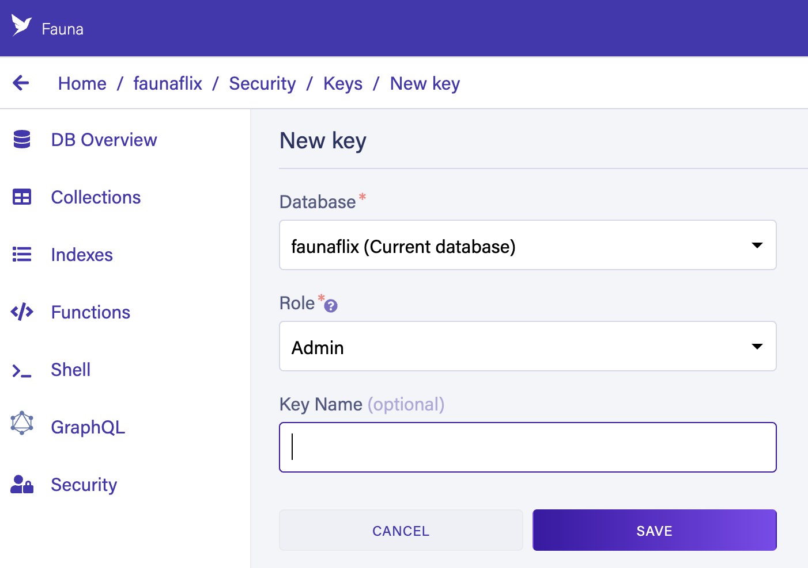
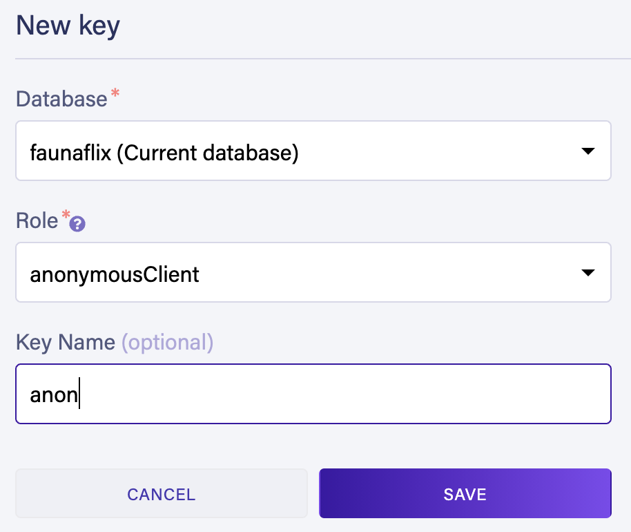

# faunaflix
faunaflix is *Fauna in a nutshell* delivered in the form a demo app that mimicks a video streaming service for kids. 
When running this app, you should immediately find the user experience very familiar. 
In this sample app, we highlight some of Fauna's key properties and functionality:
* Flexible data modeling – including relations/joins
* ACID transactions
* Use Fauna as an authentication provider – or integrate with any 3rd party OpenID Connect Identity Provider
* Delivered via API, without a backend and with zero Ops!

We'd like to point out that despite the relative complexity of such an app, it is easily modeled in Fauna:


> :bulb: Fauna is a document database that supports joins!


## Project setup

### Install Dependencies
```
npm install
```

### Create a database and obtain the "Admin Key" for the setup scripts (in the next step) to access the database.
1. Signin to Fauna 
2. Create a database: 

  

   * Specify a name for your database
   * Choose the "Classic" Region Group

3. Click [Security] in the left sidebar, then click the [New key] button.

  

   * In the "New key" form, the current database should already be selected. 
   * For the "Role" field, leave it as "Admin". Optionally, add a key name. 
   * Next, click [Save] and copy the key’s secret displayed on the next page. **It is never displayed again.**


### Run "migrations"

1. Set the `FAUNA_ADMIN_KEY` environment variable to the key you just generated above:
  ```
  export FAUNA_ADMIN_KEY=<<admin key>>
  ```

2. Look in [fauna-schema-migrate](/fauna-schema-migrate) folder and notice the contents in the `resources` folder. These are all the Collections, Indexes, Functions and Roles that we'll be creating using the [fauna-schema-migrate](https://github.com/fauna-labs/fauna-schema-migrate) tool (which is already installed when you ran `npm install` earlier). We have pre-generated the migrations in the `migrations` folder; Simply run the script command below to run these migrations:

  ```
  npm run fauna-schema-migrate
  ```

3. After resources are created from the migration step above, we need to populate some documents with operational data. Run the setup script:

  ```
  npm run setup
  ```

### Run the SPA

1. The Admin Key previously generated should only be used to setup Fauna resources. At this point you don't need it anymore.
   However, the SPA needs a different Fauna key in order to work. This key is one that's scoped to only allow access to
   limited Fauna resources (such as the [`Login`](/fauna-schema-migrate/resources/functions/Login.fql)
   and [`GetPreviews`](/fauna-schema-migrate/resources/functions/GetPreviews.fql) functions). 
   
   Click [Security] in the left sidebar, then click the [New key] button.
   
  

   * In the "New key" form, the current database should already be selected. 
   * For the "Role" field, select "anonymousClient". This was one of the Roles created during the migration step.
   * Next, click [Save] and copy the key’s secret displayed on the next page. **It is never displayed again.**

2. Create a file `.env.development.local` and populate with these values:
  ```
  VUE_APP_FAUNA_KEY_ANONYMOUS=<<key that was generated in the previouis step>>
  VUE_APP_CLIENT_ID=
  VUE_APP_ISSUER=
  ```

3. Compile and run the spa:
  ```
  npm run serve
  ```
